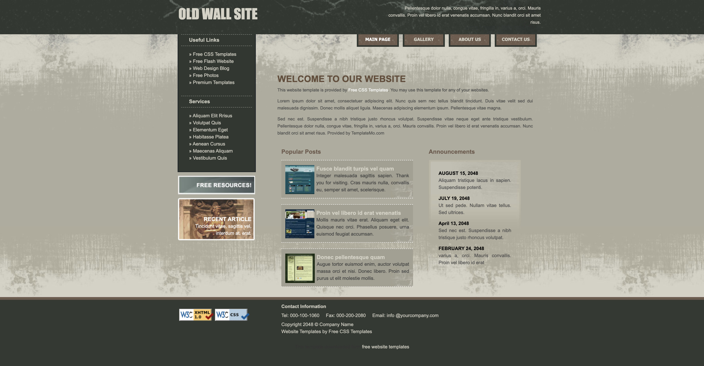
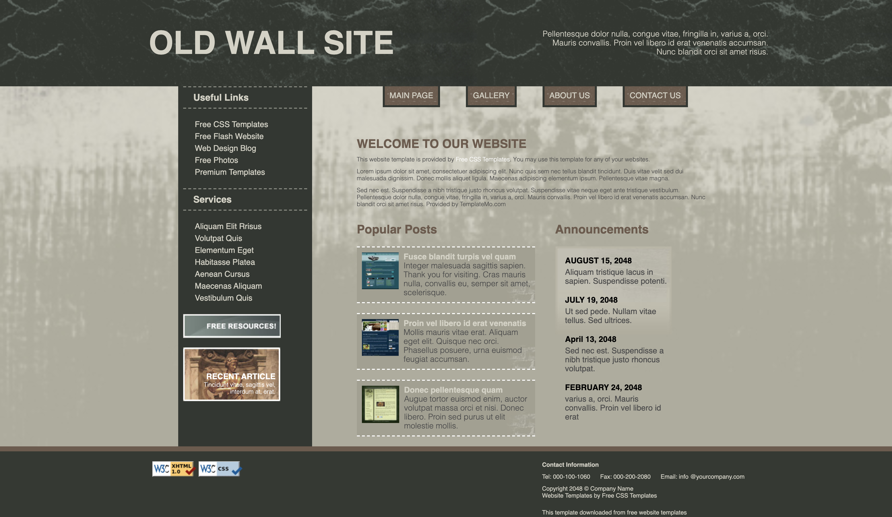
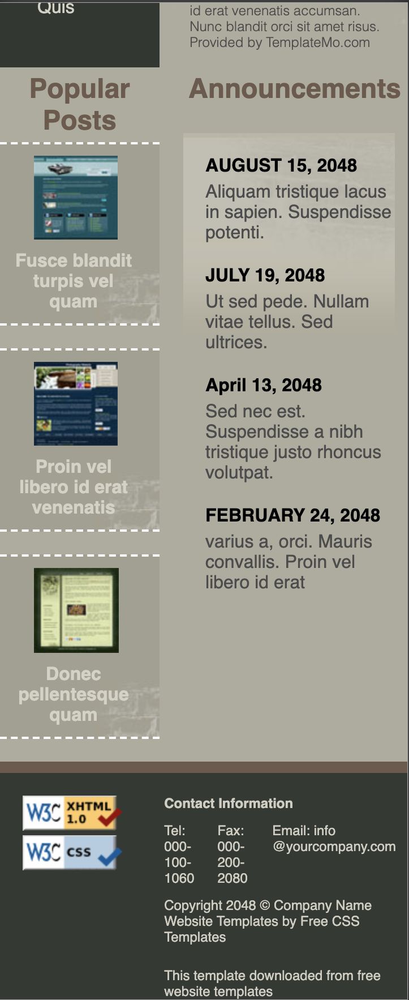
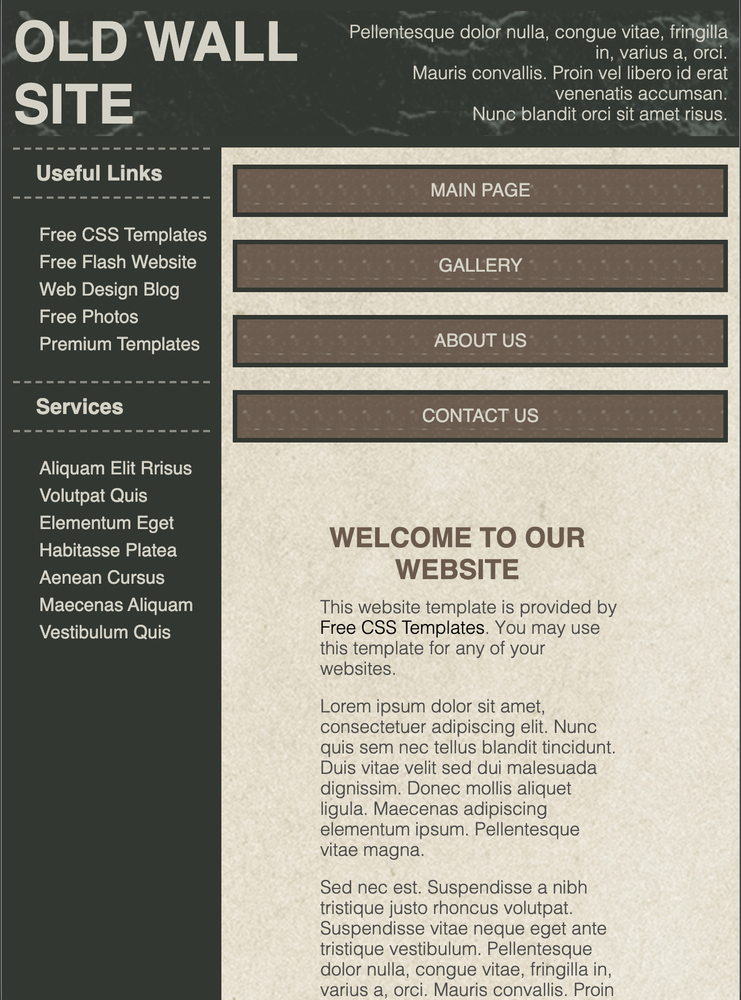
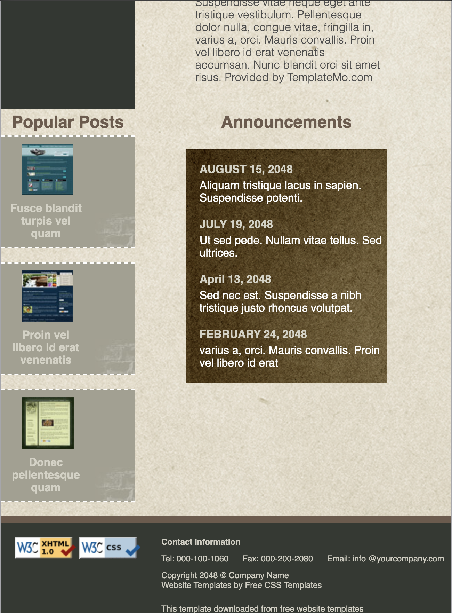

<h1> Old Wall Site </h1>

 - The prompt was to download the original website and make it responsive for mobile. Original files for the website in /original

<h2> Summary </h2>

  - [Screenshots](#screenshots)

## Screenshots

*Original:*

*Matching original in desktop view (9/26/20):*

*Current mobile screenshots:*

- New background image from rawpixel.com

*Current tablet screenshot:*

*Current desktop screenshot:*

